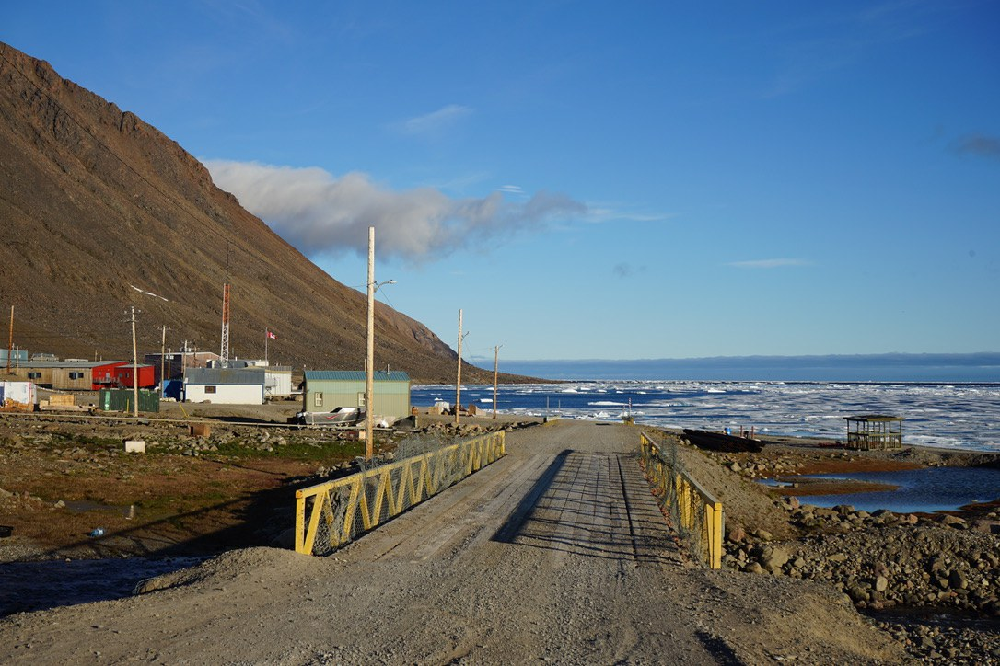
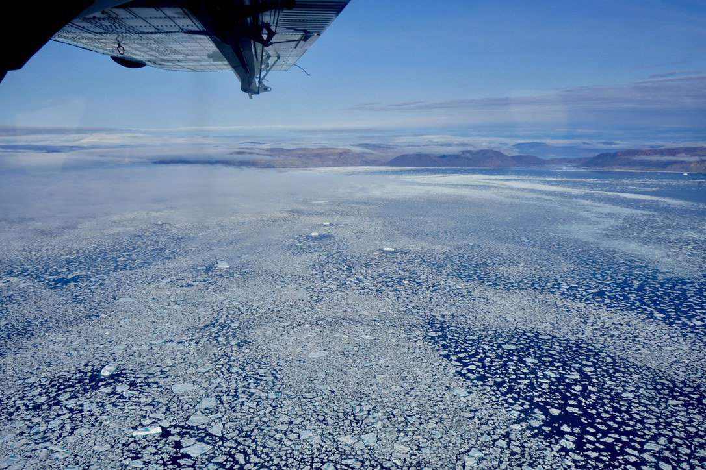

# GNSS-IR and satellite work at Grise Fiord, Nunavut

Arctic sea level from GNSS interferometric reflectometry, with satellite datasets providing context for the
PRECIPICE site in **Ausuittuq (Grise Fiord), Nunavut** (76.417 N, 82.896 W). The shore-mounted instrument is
on the south coast of Ellesmere Island, looking SSW over Jones Sound.

|  |  |
|:--:|:--:|
| *Ausuittuq (Grise Fiord), home to the northernmost community in Canada.* | *Flying from Resolute Bay to Grise Fiord.* |

<p align="center"><em>Photos: Elena Savidge</em></p>

## Notebooks

| Notebook | What it does | Data |
|---|---|---|
| [`notebooks/gnssir_processing.ipynb`](notebooks/gnssir_processing.ipynb) | This notebook walks through the processing pipeline, from measurement geometry and `gnssir-rt-dev` configuration to extracting reflector height from individual satellite arcs, applying the azimuth mask, fitting the sea level record, and producing the full 14-month series. It also checks the selected reflection area against Sentinel-2 imagery. | reads `sample_data/`, included in the repo |
| [`notebooks/grise_fiord_satellite_overview.ipynb`](notebooks/grise_fiord_satellite_overview.ipynb) | Site context maps, sea ice (concentration and ICESat-2), and SWOT sea surface height. | None are included. The cells download the required data from the providers on first run. |

Both run top to bottom, and neither depends on the other.

## Setup

```bash
conda env create -f environment.yml
conda activate arctic-eo
jupyter lab
```

Pick the **arctic-eo** kernel. If you would rather use an environment you already have, you need `numpy`,
`pandas`, `matplotlib`, `scipy`, `astropy`, `xarray`, `netCDF4`, `h5py`, `pyproj`, `cartopy`, `rioxarray`,
`pillow`, and `earthaccess`.

## Data

**The satellite data is not in the repo.** All of it is openly available, so the notebook downloads what it
needs into `data/`, which is gitignored, and skips anything already on disk. A first run downloads roughly
2 GB, most of it ICESat-2 granules, which can be skipped if you don't need them. You can store the
downloaded data in another location with:

```bash
export ARCTIC_EO_DATA=/Volumes/scratch/arctic_eo_data
```

**`sample_data/` is committed**, about 5 MB, so the GNSS-IR notebook runs without the full dataset:

| File | Contents |
|---|---|
| `one_satellite_day_240822.csv` | one satellite tracked across 2024-08-22 |
| `one_arc_240822.csv` | the single arc used in section 4, from received signal to one reflector height |
| `arcs_v5/` | three days of processed arcs, v5 config |
| `arcs_allazi_240822.csv` | one day processed with no azimuth filter, for the masking figure |
| `spline_v5_sealevel_3day.csv` | the sea level output for the same three days |
| `s2_*.jpg`, `s2_scenes.json` | two Sentinel-2 scenes cropped to 12 km around the antenna |
| `precipice_v5*.yaml` | the processing configs, one-month and full-record. Every processing parameter is exactly as run; only the `basedir` path is replaced with a placeholder so it does not point to a specific machine |

Raw NMEA and extracted SNR are too large to include (30 MB and 76 MB per day), so the first processing stage
is documented rather than executed.

The last two sections compare the GNSS-IR record with an in-situ pressure sensor and a tide model. Neither
dataset is ours to publish, so those cells display committed figures. To run them locally, set
`PRECIPICE_PRIVATE` to the folder containing the data.

**The full 14-month PRECIPICE record is not in the repo.** It is not public yet, so `sample_data/` contains
three days, enough to run every processing step. The last section of the GNSS-IR notebook shows the full
record as a committed figure, and the code that produces it will regenerate the figure for anyone working
with the complete dataset.

## Credentials

Most of it needs none. The ICESat-2 and SWOT sections need a free
[Earthdata Login](https://urs.earthdata.nasa.gov/users/new). Register, then run once:

```python
import earthaccess
earthaccess.login(persist=True)
```

That prompts and writes to `~/.netrc`; every run after is silent. 

## Data sources

| Dataset | Provider | Login |
|---|---|---|
| Tide gauge stations | [CHS IWLS API](https://api-iwls.dfo-mpo.gc.ca/api/v1/stations) | no |
| Coastlines, bathymetry, rivers | [Natural Earth](https://www.naturalearthdata.com/) | no |
| Sea-ice concentration, 25 km daily | [NOAA/NSIDC CDR G02202 V6](https://nsidc.org/data/g02202) | no |
| Sea-ice concentration, 6.25 km | [U Bremen AMSR2 ASI](https://seaice.uni-bremen.de/sea-ice-concentration/) | no |
| Sea-ice freeboard / surface height | [ICESat-2 ATL10 / ATL07](https://nsidc.org/data/icesat-2) | Earthdata |
| Sea surface height | [SWOT L2 LR SSH Expert](https://podaac.jpl.nasa.gov/dataset/SWOT_L2_LR_SSH_Expert_D) | Earthdata |
| Optical imagery | Copernicus Sentinel-2, processed by ESA, via the [Copernicus Data Space](https://dataspace.copernicus.eu/) | no, already included in the repo |

## GNSS-IR software and references

- [gnssir-rt-dev](https://github.com/Precipice-Sensors/gnssir-rt-dev) produced the sea level record here.
  It is Dave Purnell's GNSS-IR software in the version written for the custom PRECIPICE sensors that he and
  colleagues developed, and it is the version used here because this site runs that instrument.
- [gnssir-rt](https://github.com/purnelldj/gnssir-rt) is his general implementation of the same approach.
- [gnssrefl](https://github.com/kristinemlarson/gnssrefl) by Kristine Larson is the reference open toolkit
  for the technique, documented at [gnssrefl.readthedocs.io](https://gnssrefl.readthedocs.io/en/latest/).
  That is the place to read further on any part of the processing.

## Project collaborators

Elena Savidge¹, Natalya Gomez¹, David Didier², Jeremy Baudry², Terry Noah³, Dave Purnell⁴, Ruihe Zhang¹

¹McGill University · ²Université du Québec à Rimouski · ³Ausuittuq Adventures · ⁴Precipice

If you spot a mistake, please email **elena.savidge@gmail.com**
